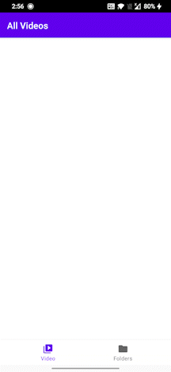
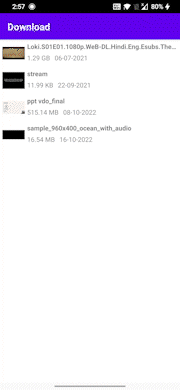
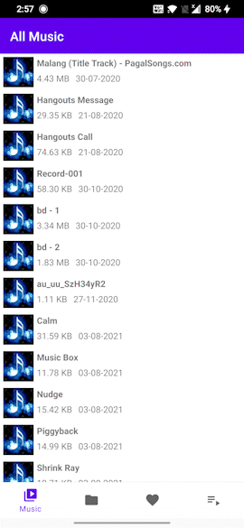

<h1 align="center">MMP-Player</h1> 

  
A multimedia player app that plays music and videos.
A user interface that displays a list of media files that are stored on the device. 
The ability to create and manage playlists of media files. 
Support for a variety of media file formats, such as MP3, MP4, and WAV. 
Smooth and seamless playback of media files without glitches or delays. 

 

  
   
 

## Previews

&nbsp;&nbsp;&nbsp;&nbsp;
&nbsp;&nbsp;&nbsp;&nbsp;
&nbsp;&nbsp;&nbsp;&nbsp;
&nbsp;&nbsp;&nbsp;&nbsp;
&nbsp;&nbsp;&nbsp;&nbsp;

## Tech stack & Open-source libraries
- Minimum SDK level 26
- 100% [Kotlin](https://kotlinlang.org/) based + [Coroutines](https://github.com/Kotlin/kotlinx.coroutines) + [Flow](https://kotlin.github.io/kotlinx.coroutines/kotlinx-coroutines-core/kotlinx.coroutines.flow/) for asynchronous.
- Hilt for dependency injection.
- Room database for storing playlists and favourites.

- Architecture
  - MVVM Architecture (Declarative View - ViewModel - Model)
