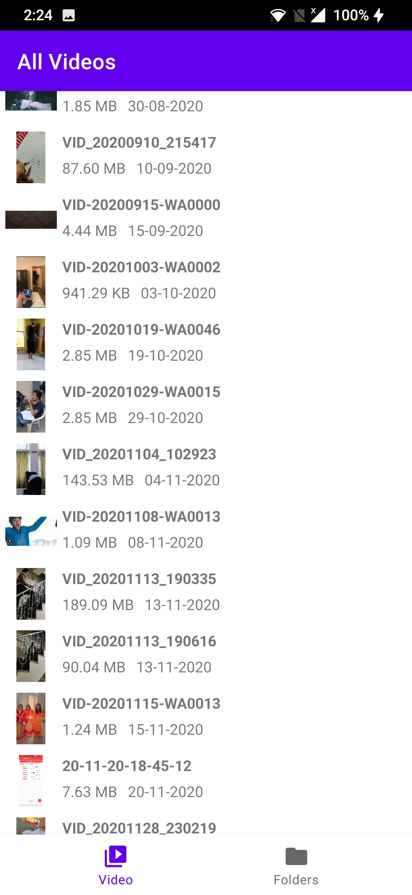
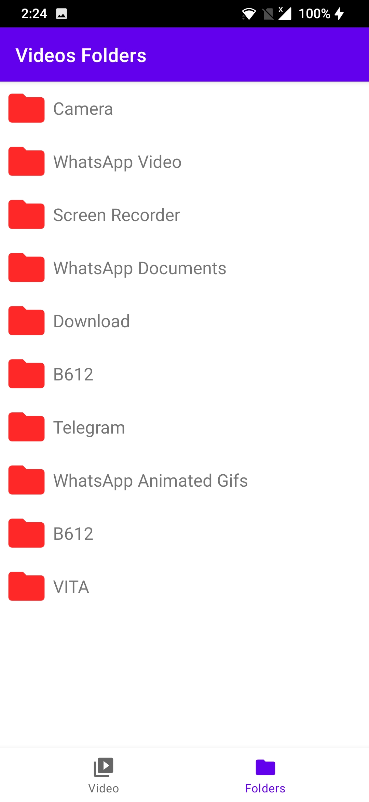
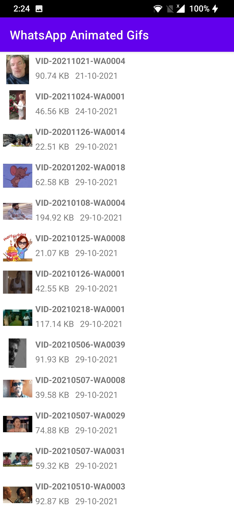

<<<<<<< HEAD
<<<<<<< HEAD
<h1 align="center">DisneyCompose</h1> 

  
A demo Disney app using compose and Hilt based on modern Android tech-stacks and MVVM architecture. Fetching data from the network and integrating persisted data in the database via repository pattern.  Declarative UI version of the <a href="https://github.com/skydoves/DisneyMotions" target="_blank"> DisneyMotions </a> using compose.
=======
<h1 align="center">MMP Player</h1> 

  
A media player app using compose and Hilt based on modern Android tech-stacks and MVVM architecture. Play videos or music store in your local phone storage. Create music playlists and add to your favorites.
>>>>>>> 14589f75d1b7f4f8311ef680b7ea7c9a2c3f027f
=======
<h1 align="center">MMP Player</h1> 

  
A media player app using compose and Hilt based on modern Android tech-stacks and MVVM architecture. Play videos or music store in your local phone storage. Create music playlists and add to your favorites.
>>>>>>> 052d5fa (Update README.md)

 

  
<<<<<<< HEAD
<<<<<<< HEAD
   
=======
   
>>>>>>> 052d5fa (Update README.md)

## Download

## Screenshots

<<<<<<< HEAD

=======
   
 

## Download

## Screenshots

&nbsp;&nbsp;&nbsp;&nbsp;
&nbsp;&nbsp;&nbsp;&nbsp;
&nbsp;&nbsp;&nbsp;&nbsp;
&nbsp;&nbsp;&nbsp;&nbsp;

>>>>>>> 14589f75d1b7f4f8311ef680b7ea7c9a2c3f027f
=======

>>>>>>> 052d5fa (Update README.md)

## Tech stack & Open-source libraries
- Minimum SDK level 21
- 100% [Kotlin](https://kotlinlang.org/) based + [Coroutines](https://github.com/Kotlin/kotlinx.coroutines) + [Flow](https://kotlin.github.io/kotlinx.coroutines/kotlinx-coroutines-core/kotlinx.coroutines.flow/) for asynchronous.
- Hilt for dependency injection.
<<<<<<< HEAD
=======
- Room database to create playlists and add favourites.
>>>>>>> 14589f75d1b7f4f8311ef680b7ea7c9a2c3f027f

- Architecture
  - MVVM Architecture (Declarative View - ViewModel - Model)
